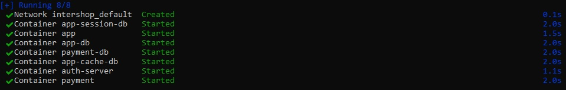
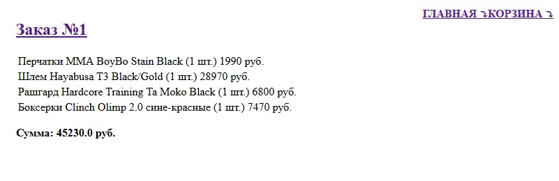

# intershop

Витрина интернет-магазина

Веб приложение - витрина интернет-магазина на Spring Boot Framework. Включает в себя функциональность  
просмотра товаров интернет-магазина, заполнения корзины и формирования заказа.

Проект состоит из двух модулей:
* [Основное веб-приложение с Web UI](app)
* [RESTful-сервис платежей](payment)

## Стек технологий
- **Java 21**
- **Spring Framework**
- **Spring WebFlux для обработки HTTP-запросов**
- **Spring Security для ограничения доступа к функционалу приложения**
- **OAuth2 Authorization Code Flow для взаимодействия между бэкенд-сервисами**
- **Keycloak сервер авторизации для получения/проверки jwt токенов**
- **Spring Data R2DBC для работы с базой данных**
- **Postgres база данных для хранения сущностей приложения**
- **Redis база данных для кеширования**
- **Redis база данных для хранения сессий пользователей**
- **Liquibase для миграции базы данных**
- **OpenApi generator для генерации контроллеров RestFull сервиса и клиента к нему**
- **Testcontainers, JUnit 5, Assertj, Mockito для тестирования**
- **Mapstruct для преобразования сущностей базы данных и сущностей передачи данных**
- **WebTestClient для интеграционного тестирования**
- **Thymeleaf для шаблонов html страниц**
- **Spring validation для валидации пользовательских данных**
- **Lombok для генерации шаблонного кода**
- **Docker для развёртывания и запуска контейнеров postgres, redis, keycloak и разработанных веб-приложений**

## Запуск приложения

Склонировать репозиторий с кодом и перейти в корневую директорию проекта.

```bash
git clone https://github.com/alextim1508/intershop
```

Запустить docker compose файл.

```bash
docker-compose -f docker-compose.yml up -d
```



Открыть в браузере вкладку с адресом.

```bash
http://localhost:8080/
```
Откроется главная страница витрины интернет-магазина.


Доступен поиск по названию и описанию товаров, сортировка по алфавиту/цене, пагинация.
Для добавления товара в корзину необходимо нажать на кнопку "+" или "В корзину". 
Для перехода в корзину в правом верхнем углу есть соответствующая ссылка.
На странице Корзины есть функционал для ее редактирования.


Если пользователь не авторизован, то появится окно для ввода логина и пароля.


Используйте данные пользователя:

```bash
username: alex
password: password
```

Для формирования заказа на странице "Корзина" нужно нажать на кнопку "Купить".


Так же в правом верхнем углу есть ссылка на страницу выполненных заказов.

